# Textbooks — User Journey (Browse → Buy → Read)

This document describes **what a visitor sees and does** when they use the Textbooks
section, screen by screen, and the exact navigation between screens. It is the
"how it works for the user" companion to the deeper
[Textbooks Workflow — Architecture & Operations Guide](./textbooks_workflow.md).

- **Flowchart (rectangles = screens/actions, diamonds = decisions):** [`textbooks_user_journey_flowchart.svg`](./textbooks_user_journey_flowchart.svg)
- A Mermaid version of the same flowchart is at the end of this document.

---

## 1. The screens, in order

| # | Screen | Route | What the user does here |
|---|--------|-------|-------------------------|
| 1 | **Textbooks landing** | `/textbooks` | Lands on the page. Sees a segmented control with two tabs — **Upcoming Books** and **Published Books** (default: *Upcoming*). Header has two buttons: **Go to Bookstore** and **Access Portal**. |
| 2 | **Upcoming Books tab** | `/textbooks?tab=upcoming` | Sees cards for books that are *In Press* (editorial-progress bars). Clicking **View Details** opens an info modal (About the Book, ISBN, expected date). These titles are **not for sale yet** — dead end. |
| 3 | **Published Books tab** | `/textbooks?tab=published` | Sees a grid of published book cards: cover, title, author, short description, price, ISBNs, "In Stock". Each card has **View Details** and **Buy Now**. |
| 4 | **Book detail page** | `/textbooks/{slug}` | Full book page: description, long description, **Table of Contents**, specs grid (ISBNs, pages, prices), keywords, related books. A format selector box: **Paperback · Digital PDF · Rent**. |
| 5 | **Bookstore listing** | `/textbooks/store` | Searchable catalog of all books with per-book **Buy Now** / **Add to Cart**, a cart drawer, and rental options. |
| 6 | **Checkout** | `/textbooks/store/checkout?bookId&format&plan` | 3 steps: **(1)** contact + shipping address + coupon → **(2)** review totals → **(3)** pay via Cashfree. Then a success screen with the Order ID. |
| 7 | **Portal login** | `/textbooks/portal/login` | Sign in. Two methods: **email + password** (store buyers/renters) or **Access ID + college email/mobile → OTP** (institution students/faculty/admin). |
| 8 | **My Library** | `/textbooks/portal` (My Books tab) | Logged-in reader sees their **purchased books** and **active rentals**, with an **Open / Read** button. |
| 9 | **Secure eBook Reader** | `/textbooks/reader/[rentalId]` (rentals) or in-portal viewer | Reads the PDF in a locked viewer — per-user watermark, right-click / print / save disabled. |

---

## 2. Navigation — click by click

### Entering
1. User opens **`/textbooks`**.
2. The page shows the **Upcoming Books** / **Published Books** tabs.
   - **Upcoming Books** → grid of *In Press* titles → **View Details** opens a modal only. No purchase path (the book isn't published yet).
   - **Published Books** → grid of purchasable books. Continue below.

### From "Published Books"
3. On a published book card the user can:
   - Click the **cover, the title, or "View Details"** → goes to the **book detail page** `/textbooks/{slug}`.
   - Click **"Buy Now"** → goes to the **Bookstore listing** `/textbooks/store`.
   - (Header) **"Go to Bookstore"** → `/textbooks/store`; **"Access Portal"** → `/textbooks/portal/login`.

### On the book detail page (`/textbooks/{slug}`)
4. The user reads the description / Table of Contents / specs and picks a **format**:
   - **Paperback** → button "Buy Paperback (₹price)".
   - **Digital PDF** → button "Get Digital Copy (₹price)".
   - **Rent** → opens the **rental plan modal** (1 month ₹59 · 3 months ₹99 · 6 months ₹149), then pick a plan.
5. Any of those choices → **redirect to `/textbooks/store/checkout?bookId=…&format=…&plan=…`**.

### In the Bookstore listing (`/textbooks/store`)
6. The user can:
   - **Open any book** → book detail page `/textbooks/{slug}`.
   - **Add to Cart** → item stored in the browser cart; keep browsing.
   - **Buy Now / Checkout** → proceed to checkout (see the sign-in gate next).

### Sign-in gate
7. Checkout needs an account (so the purchase can be attached to the reader's library).
   - **Already signed in** → straight to Checkout Step 1.
   - **Not signed in** → a login prompt sends the user to `/textbooks/portal/login?redirect=checkout`. After signing in (email + password, or Access ID + OTP) they are returned to checkout.

### Checkout (`/textbooks/store/checkout`)
8. **Step 1** — enter contact details, shipping address (digital formats skip shipping), optional coupon.
9. **Step 2** — review the total: `book price + 18% GST + 2% online fee + shipping` (shipping is pincode-tiered; ₹0 for digital/rental).
10. **Step 3** — **Pay via Cashfree** (hosted card / UPI / net-banking screen).
11. **Payment result:**
    - **Failed / cancelled** → error message, user retries Step 3.
    - **Succeeded** → the server verifies the payment, then **creates the account + a single Access ID, adds the book to the reader's library (or activates the rental), and emails a confirmation**. A **success screen** shows the Order ID and a **"Go to My Library"** button.

### After purchase
12. **"Go to My Library"** → `/textbooks/portal/login` → **My Library**, which lists purchased books and active rentals.
13. **Open / Read** → the **Secure eBook Reader** (watermarked, no download or print). Rentals also show a countdown timer and a **Renew** option.

---

## 3. Key rules the user experiences

- **Upcoming books can't be bought** — they only have an information modal until they're published.
- **"Buy Now" on a book card goes to the store**, not straight to payment — the user still picks format/plan and reviews the order.
- **One account, one Access ID per person** — buying a second book adds it to the same library; it does not create a new login.
- **Rentals are time-limited** — after the plan period the book locks; the reader gets 7-day and 1-day warning emails and can renew (renewing early rolls over the remaining days).
- **A digital purchase is instant** — no shipping step; the book appears in My Library right after payment.
- **The reader is locked** — right-click, print (Ctrl/Cmd+P) and save (Ctrl/Cmd+S) are disabled and every page is watermarked with the reader's identity.

---

## 4. Flowchart (Mermaid)

```mermaid
flowchart TD
    START(["User opens /textbooks"]) --> LAND["Textbooks landing page<br/>tabs: Upcoming Books · Published Books"]
    LAND --> TAB{"Which tab?"}

    TAB -->|Upcoming| UPC["Upcoming Books grid<br/>(In Press · editorial progress)"]
    UPC --> UPCV["Click 'View Details'<br/>→ info modal (About, ISBN, date)"]
    UPCV --> UPCEND(["Browse only — not yet on sale"])

    TAB -->|Published| PUB["Published Books grid<br/>cover · title · ₹price · ISBN · In Stock"]
    PUB --> CLICK{"User clicks…?"}

    CLICK -->|"'Buy Now'"| STORE["/textbooks/store<br/>Bookstore listing (search · cards · cart)"]
    CLICK -->|"cover / 'View Details'"| BOOK["/textbooks/{slug}<br/>Book detail page — description, ToC, specs"]

    STORE --> SACT{"Action in Bookstore?"}
    SACT -->|add to cart| CART["Cart updated (saved in browser)"]
    CART --> STORE
    SACT -->|open a book| BOOK
    SACT -->|buy this book| CHK

    BOOK --> FMT{"Select edition format?"}
    FMT -->|Paperback| CHK["Redirect to /textbooks/store/checkout<br/>?bookId & format & plan"]
    FMT -->|Digital PDF| CHK
    FMT -->|Rent| PLAN["Choose rental plan<br/>1 mo ₹59 · 3 mo ₹99 · 6 mo ₹149"]
    PLAN --> CHK

    CHK --> AUTH{"Signed in?"}
    AUTH -->|No| LOGIN["Sign in at /textbooks/portal/login<br/>email + password, or Access ID + email/mobile → OTP"]
    LOGIN --> S1
    AUTH -->|Yes| S1["Checkout · Step 1<br/>contact + shipping address + coupon"]

    S1 --> S2["Checkout · Step 2<br/>review total: base + 18% GST + 2% fee + shipping"]
    S2 --> S3["Checkout · Step 3<br/>Pay via Cashfree (card · UPI · netbanking)"]
    S3 --> PAY{"Payment successful?"}
    PAY -->|No| ERR["Payment error — retry"]
    ERR --> S3
    PAY -->|Yes| VERIFY["Order verified (server)<br/>account + one Access ID created,<br/>book added to My Library / rental activated,<br/>confirmation email sent"]

    VERIFY --> DONE["Success screen<br/>Order ID + 'Go to My Library'"]
    DONE --> LIB{"Open My Library now?"}
    LIB -->|No| END(["End"])
    LIB -->|Yes| MYLIB["/textbooks/portal → My Library<br/>purchased books + active rentals"]
    MYLIB --> READER["Open Secure eBook Reader<br/>watermarked · no download / print"]
    READER --> END
```

