# Textbooks Workflow — Architecture & Operations Guide

This document is the reference for the **Textbooks** subsystem of Lurnexa Publications:
the public catalog, the storefront (paperback / digital / rental), the institutional
access portal, the secure eBook reader, the faculty quiz + student practice engine, and
the institutional bulk‑quotation pipeline.

It is intended for engineers extending the subsystem, for operations staff who support
customers and institutions, and for anyone reviewing how money, entitlements and content
access flow through the platform.

- **Stack:** Next.js 16 (App Router) · React 18 · PostgreSQL (`pg`) · AWS S3 · Cashfree PG · Nodemailer · Twilio
- **Primary code roots:** `app/textbooks/**`, `app/api/textbooks/**`, `app/api/payments/**`, `app/api/rentals/**`, `app/api/quotation/**`, `app/quotation/**`, `lib/data/books.ts`, `lib/data/rentals.ts`, `lib/dbClient.ts`, `lib/dbPool.ts`

---

## 1. Scope & Vocabulary

| Term | Meaning |
|---|---|
| **Book / Textbook** | A published academic title. Canonical catalog record lives in `lib/data/books.ts` (`PUBLISHED_BOOKS_DATA`). A lightweight registry (`id`, `title`, `code`) is also mirrored in the `textbooks_textbooks` DB table for the admin portal. |
| **Format** | How a book is acquired: `physical` (paperback, shipped), `soft` (permanent digital copy), `rental` (time‑boxed digital access). |
| **Plan** | Sub‑variant of a purchase: `complete`, `book_only`, `caselet`, `book_caselet`, `book_portal`, `book_caselet_portal`, `placements`, `practice`. Drives pricing and portal entitlements. |
| **Access ID** | The single stable identifier that ties a person to their entitlements in the portal. Prefixes: `LURN…`/`LS…` = student, `LF…` = faculty, `LURNEXA`/`ADMIN` = administrator. |
| **Rental** | A row in `book_rentals` with a lifecycle (`pending → active → expired`, plus `renewed`). Grants 30/90/180‑day reader access. |
| **Portal** | `/textbooks/portal` — authenticated area for students, faculty and admin. |
| **Reading App** | `/textbooks/app` — the same portal component in `appMode` (PWA, marketing chrome and admin tools hidden). |
| **Quotation** | Institutional bulk‑order flow (`/quotation`): request → admin quote → client e‑sign → confirmed order. Separate admin auth and DB tables from the consumer store. |

---

## 2. Architecture Block Diagram

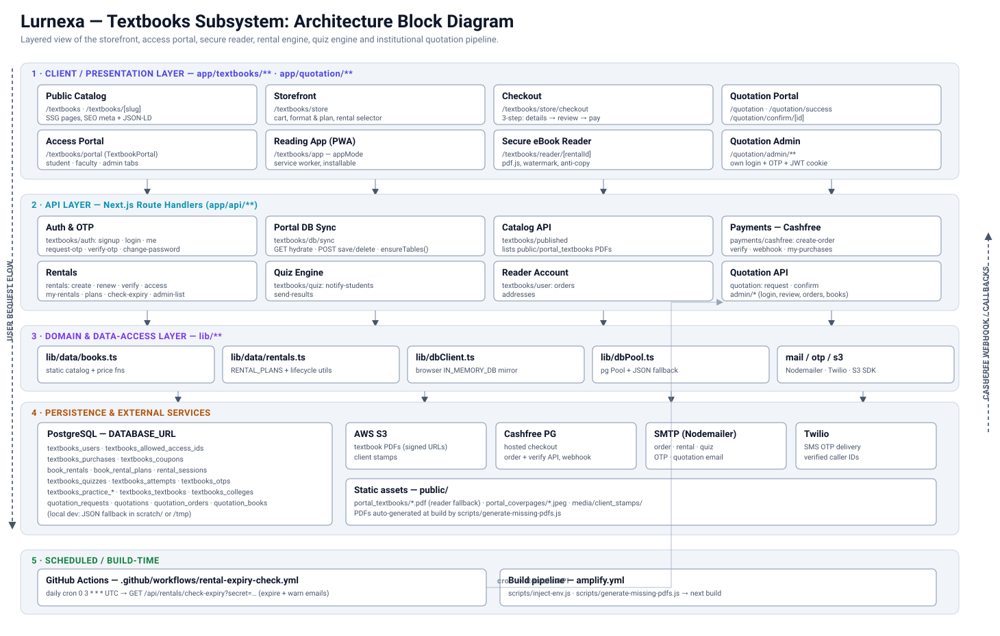

> Source: [`docs/textbooks_architecture_block_diagram.svg`](./textbooks_architecture_block_diagram.svg) — open it directly for a full‑resolution, zoomable view.

The subsystem is organised in five layers. A request enters at the top (client), is served by a
Next.js route handler, which reads business rules from the domain layer and reads/writes the
persistence layer; Cashfree calls back into the API layer asynchronously (right rail); a GitHub
Actions cron drives the rental‑expiry endpoint on a schedule (bottom).

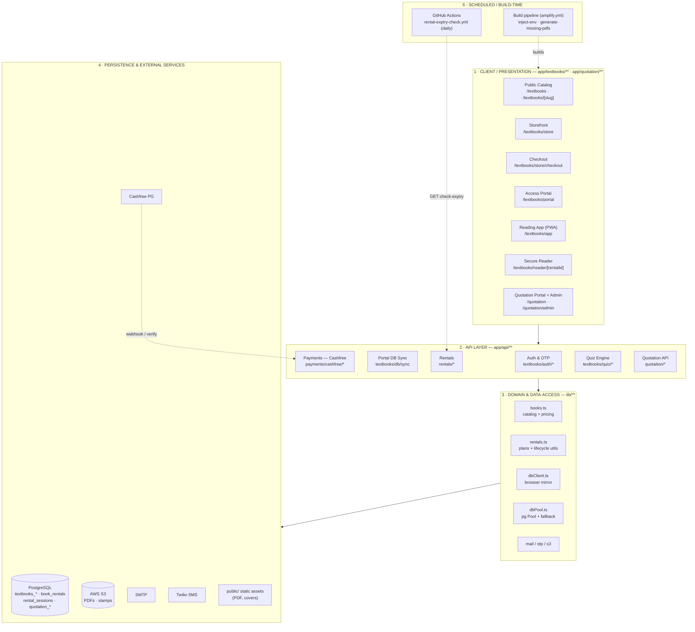

---

## 3. System Context

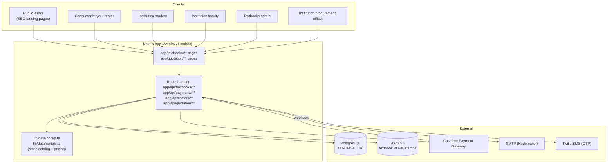

---

## 4. Data Storage Model

### 4.1 Three layers

1. **Static catalog (build‑time):** `lib/data/books.ts` and `lib/data/rentals.ts`. Source of truth for titles, ISBNs, prices, cover images, table of contents, rental plans. Editing a book = code change + deploy.
2. **PostgreSQL (runtime):** operational data — users, entitlements, purchases, rentals, quizzes, attempts, OTPs, quotations. Accessed only from server route handlers via the shared pool in `lib/dbPool.ts`.
3. **Client in‑memory mirror:** `lib/dbClient.ts` keeps an `IN_MEMORY_DB` object in the browser for the admin/portal UI. On load it calls `GET /api/textbooks/db/sync` (`syncFromServer`) to hydrate; every mutating helper (`setStorageItem`) writes through to `POST /api/textbooks/db/sync`. Legacy `localStorage` copies are actively purged (`initDb`, purge keys `lurnexa_db_purge_v5/v6`).

> ⚠️ **Consistency note.** The client mirror is a convenience cache, not an authority. Anything that gates money or content access (payment verification, rental activation, reader session issue) is re‑checked server‑side against Postgres.

### 4.2 Local fallback

`lib/dbPool.ts` detects a missing/placeholder `DATABASE_URL` (`useLocalFallback`) and swaps to JSON files under `scratch/` (or `/tmp` on Lambda) for `otps.json` / `purchases.json`. This is a **local‑dev convenience only** — production always has a real `DATABASE_URL`. (See commit `7c0c0ac` for the fix that stopped this fallback from silently masking real DB outages.)

### 4.3 Key tables

| Table | Purpose | Written by |
|---|---|---|
| `textbooks_users` | Portal accounts (student/faculty/admin + consumer readers). Holds `access_id`, `role`, `plan`, `purchased_books` (JSONB), `password_hash`, `email`. | signup, checkout verify, portal admin, `db/sync` |
| `textbooks_allowed_access_ids` | Registry of every valid Access ID → `book_id`, `role`, `assigned_to`, `college_code`, `plan`. An ID must exist here before a user can bind to it. | admin ID generation, checkout verify/webhook, `db/sync` |
| `textbooks_textbooks` | Lightweight book registry (`id`, `title`, `code`) for the admin portal. | admin portal, `db/sync` |
| `textbooks_colleges` | College code → name. | admin portal |
| `textbooks_purchases` | One row per **paid** store order (physical + soft). Never inserted until payment is verified. | `payments/cashfree/verify`, `payments/cashfree/webhook` |
| `textbooks_coupons` | Discount codes, per book, per format. | admin portal |
| `textbooks_quizzes` / `textbooks_attempts` | Faculty‑authored quizzes and student submissions. | portal (faculty/student) |
| `textbooks_practice_tests` / `textbooks_practice_attempts` / `textbooks_book_chapters` / `textbooks_practice_configs` | Self‑practice engine config + results. | portal |
| `textbooks_interview_questions` / `textbooks_company_updates` | Career Hub content. | portal admin |
| `textbooks_otps` | Hashed 6‑digit OTPs, 5‑min TTL, 3‑attempt lock, 60‑s resend cooldown. | `auth/request-otp`, `auth/verify-otp` |
| `book_rentals` | Rental lifecycle records. | `rentals/create`, `rentals/renew`, `rentals/verify`, `rentals/check-expiry` |
| `book_rental_plans` | Optional DB override of `RENTAL_PLANS`; falls back to code constants. | ops (manual) |
| `rental_sessions` | Active secure‑reader sessions (one per rental, 2‑h token). | `rentals/access` |
| `quotation_requests` / `quotations` / `quotation_orders` / `quotation_books` | Institutional bulk‑quote pipeline. | `quotation/*` routes |

`ensureTables()` in `app/api/textbooks/db/sync/route.ts` runs `CREATE TABLE IF NOT EXISTS` + additive `ALTER TABLE … ADD COLUMN IF NOT EXISTS` on every call — schema migrations for the `textbooks_*` tables are effectively self‑applying.

---

## 5. Actors & Roles

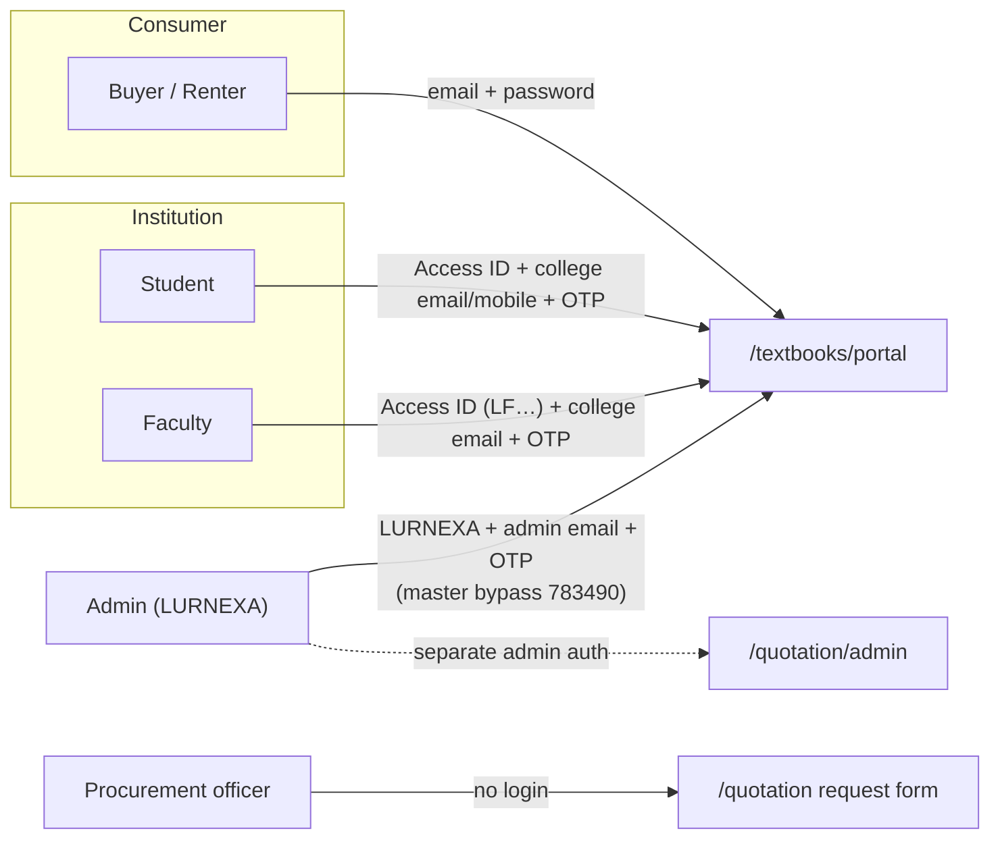

| Role | How they authenticate | What they can do |
|---|---|---|
| **Consumer buyer/renter** | `POST /api/textbooks/auth/signup` / `login` (email + password). Account auto‑created at payment verification; user later "claims" it by setting a password. | See purchased books & active rentals in *My Library*, open the secure reader, renew rentals, manage shipping addresses. |
| **Student** | Access ID (`LURN…`/`LS…`) + college email or mobile → OTP. Bypass `783490` for `*@lurnexa.in` demo IDs. | Read entitled book + caselet, take faculty quizzes, self‑practice, view quiz history, Career Hub, profile. Tabs `join`/`practice`/`history`/`studentCareerHub` are currently hidden for students (`isTabAllowed`). |
| **Faculty** | Access ID (`LF…`) + college email → OTP. | Author/schedule quizzes, notify students by email, grade written answers, email result sheets, view roster. |
| **Admin** | `LURNEXA` (or `ADMIN`) + `lurnexapublication@gmail.com` / `9347834904` → OTP, or master bypass code `783490` (works offline / DB‑down). Seeded idempotently by `initDb()`. | Manage users, Access IDs (single + bulk), textbook registry, colleges, coupons, question bank, practice tests, payments dashboard (purchases + rentals), Career Hub. |
| **Procurement officer** | None — public form. | Submit a bulk book quotation request; later open the quote link and confirm with an uploaded stamp/signature. |
| **Quotation admin** | `app/api/quotation/admin/*` — own login + OTP verify + JWT cookie (`lib/quotationAuth.ts`). | Price requests into quotations, manage the quotation book list, view confirmed orders. |

---

## 6. Workflow A — Discovery → Book Detail (public)

SEO landing pages funnel visitors into the storefront.

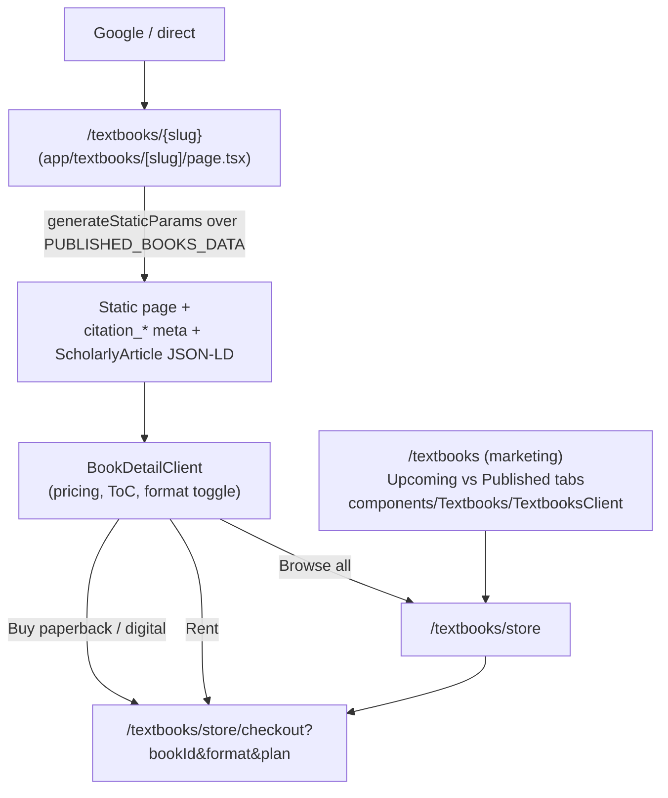

- Catalog list + slug/ISBN lookup helpers: `getAllBooks`, `getBookBySlug`, `getBookByIsbn`, `slugifyBookTitle` in `lib/data/books.ts`.
- Per‑book / per‑plan pricing is centralized: `getPhysicalPrice`, `getSoftCopyPrice` (`lib/data/books.ts`); the storefront and checkout both call these so displayed and charged prices cannot drift.
- Missing PDFs are generated at build time by `scripts/generate-missing-pdfs.js` (hooked into `npm run build`).

---

## 7. Workflow B — Purchase (paperback / digital soft copy)

### 7.1 Sequence

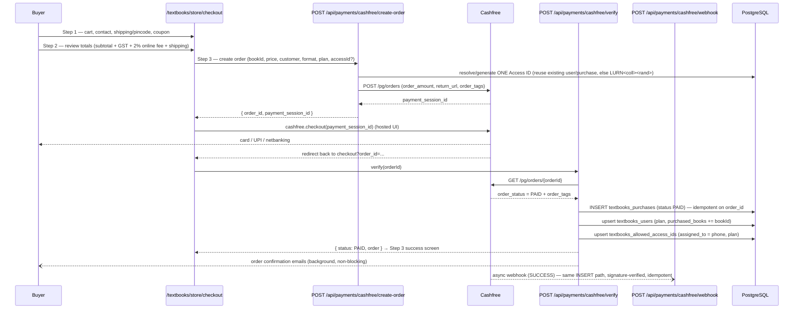

### 7.2 Rules & invariants

- **No order row before payment.** `textbooks_purchases` is written only by `verify` or `webhook`, both guarded by `status === 'PAID'` and idempotent on `order_id`.
- **Webhook is the safety net.** If the buyer closes the tab before the redirect, the signed Cashfree webhook (`x-webhook-signature` HMAC‑SHA256 over `timestamp + rawBody`) still finalizes the order and sends emails.
- **One Access ID per person.** `create-order` and `verify` both try, in order: existing `textbooks_users.access_id` → existing `textbooks_purchases.access_id` → generate `LURN<collegeCode|OT><5 digits>` (collision‑checked). The buyer's account, purchase row and allowed‑ID row all converge on that one ID.
- **Totals formula** (checkout + `lib/data/rentals.ts` helpers for the rental line): `base + 18% GST + 2% online processing fee (on base+GST) + shipping`. Shipping is pincode‑tiered (`getShippingCost` in checkout): Guntur ₹40 · AP/TS ₹60 · rest of South ₹80 · rest of India ₹120 · digital ₹0.
- **Format‑specific guards:** ML (`id 2`) and AI (`id 6`) reject `caselet`/`book_caselet` soft‑copy plans server‑side. Caselet‑bearing books: `bookHasCaselet` → ids `3`, `5`.
- **Emails never block the response** — `sendOrderConfirmationEmails` is fired and `.catch`‑logged so the buyer's success screen is instant.

---

## 8. Workflow C — eBook Rental Lifecycle

### 8.1 States

```mermaid
stateDiagram-v2
    [*] --> pending: POST /api/rentals/create
    pending --> active: POST /api/rentals/verify (Cashfree PAID)
    pending --> [*]: abandoned (no cleanup job; stays 'pending')
    active --> active: reader sessions (rentals/access)
    active --> expired: expires_at passed\n(rentals/access lazy check OR check-expiry cron)
    active --> renewed: early renewal creates child rental
    expired --> active: late renewal (new period from now)
    renewed --> [*]
    expired --> [*]
```

### 8.2 Rent → Read sequence

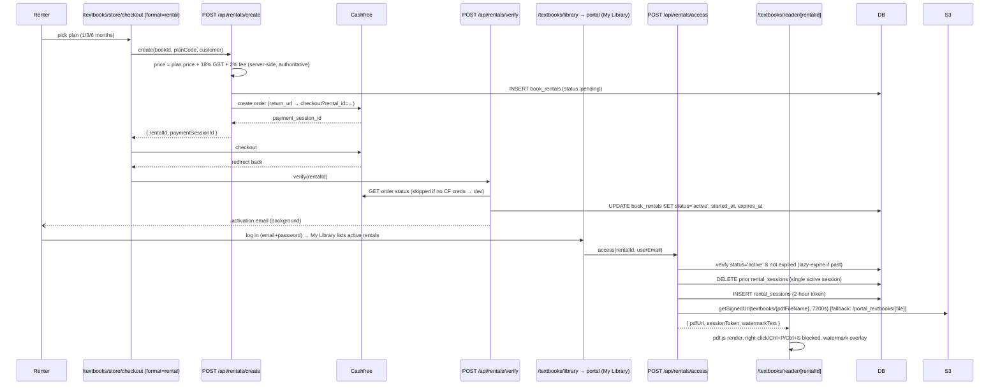

### 8.3 Renewal

- `POST /api/rentals/renew` creates a **child** `book_rentals` row (`is_renewal = true`, `parent_rental_id`, `renewal_count++`), then the same Cashfree → `rentals/verify` path activates it.
- `calculateRenewalExpiry` (`lib/data/rentals.ts`): **early** renewal (parent not yet expired) extends from `parent.expires_at`; **late** renewal starts from now.
- UI: `components/Textbooks/RenewModal.tsx`, `RentalPlanSelector.tsx`, `RentalTimer.tsx`, `RentalBadge.tsx`.

### 8.4 Expiry cron

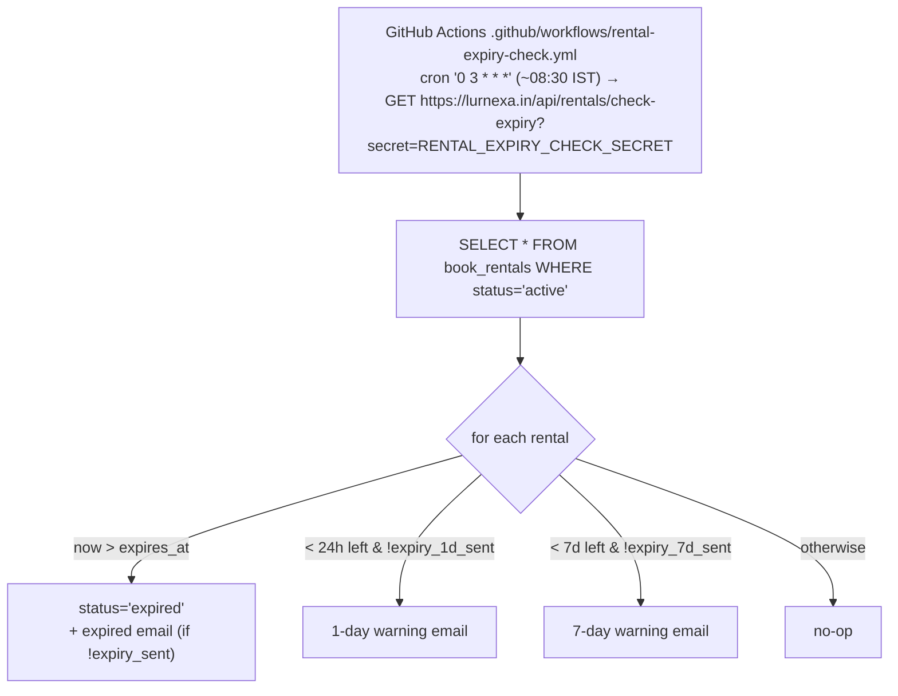

- Emails: `generateRentalActivationEmail`, `generateExpiryWarningEmail`, `generateRentalExpiredEmail`, `generateRenewalConfirmationEmail` — all in `lib/data/rentals.ts`.
- `rentals/access` also lazily flips a past‑due `active` rental to `expired` on the next read attempt, so access is correct even if the cron missed a run.
- **Rentals are never merged into `purchased_books`** — `auth/login`, `auth/signup`, `auth/me` return `rentedBooks` as a *separate* list. (Regression guard: a rental once showed as "Permanent Access".)

---

## 9. Workflow D — Portal Authentication

Two independent auth modes converge on the same portal component (`app/textbooks/portal/TextbookPortal.tsx`).

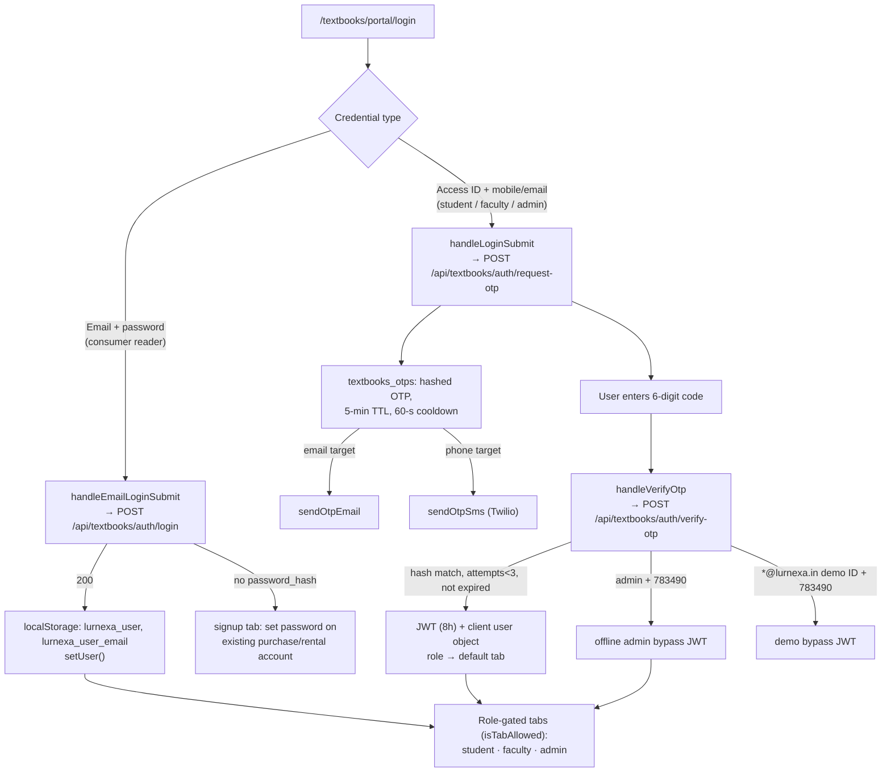

- **Signup validation** (`auth/signup`): email regex, password ≥ 8 chars with upper + lower + digit + special. `password_hash = sha256(password + "lurnexa_pub_salt_2026")`.
- **Account claiming:** a buyer/renter row created at payment has no `password_hash`; signing up with that email sets the password and activates it (does not error as "already exists").
- **OTP hardening:** hashed at rest (`sha256(otp)`), 3 wrong attempts locks the code, 60‑second resend cooldown, validated codes are deleted.
- Session token from `auth/login`/`signup` is a base64 `email:timestamp` marker (not a verified JWT) — the OTP path issues a real signed JWT (`JWT_SECRET`, 8 h).

---

## 10. Workflow E — Access IDs & Entitlements

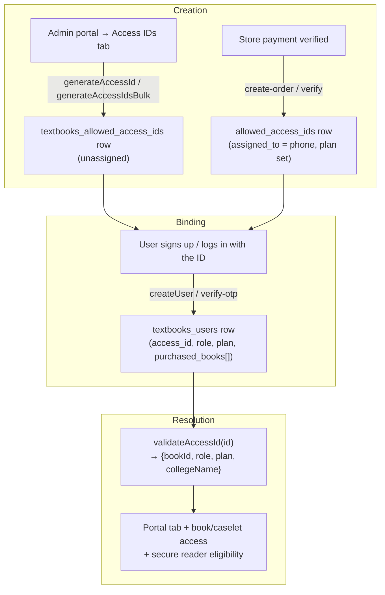

- ID format: `<rolePrefix><collegeCode><counter>` — faculty `LF`, student `LURN`/`LS`; college code or `OT` (others); counters start at `26001` for admin‑generated, random 5‑digit for payment‑generated.
- `validateAccessId` special‑cases `ADMIN`/`LURNEXA`.
- `deleteTextbook` cascades: questions, chapters config, allowed IDs, quizzes, quiz attempts, practice attempts — locally and via `db/sync` `action:"delete"`.
- A user's durable entitlement is `textbooks_users.purchased_books` (JSONB array of book ids) + `plan`. Store `verify`/`webhook` append to it on every paid order.

---

## 11. Workflow F — Secure eBook Reader

Applies to **rentals** (`/textbooks/reader/[rentalId]`) and to portal in‑app reading of owned books / caselets (`openSecureBook`, `openSecureCaselet`, `openSecureRental` in `TextbookPortal.tsx`).

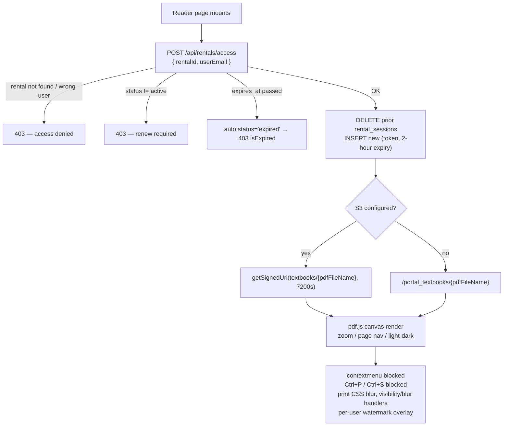

- Single active session per rental (prior tokens deleted on each `access` call).
- `watermarkText` = `"{email} • Rental #{last6} • Lurnexa Protected"`.
- Reader layout sets `robots: { index: false }`.

---

## 12. Workflow G — Faculty Quizzes & Student Practice

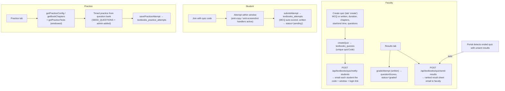

- Question bank seed: `lib/data/practice_questions.ts` (`SEED_QUESTIONS`), extended per‑book via the admin *Question Bank* tab.
- Quiz total marks: written quizzes sum `maxMarks`; MCQ = question count.
- Admin *Practice Results* tab aggregates `getAllPracticeAttempts`.

---

## 13. Workflow H — Institutional Bulk Quotation

Separate pipeline, separate admin auth, separate tables.

```mermaid
sequenceDiagram
    participant I as Procurement officer
    participant RQ as /quotation  (POST /api/quotation/request)
    participant QA as Quotation admin (/quotation/admin)
    participant Rev as POST /api/quotation/admin/review
    participant C as /quotation/confirm/[id]  (POST /api/quotation/confirm)
    participant DB as PostgreSQL
    participant S3 as AWS S3

    I->>RQ: institution, authorized person, contact, email, items[]
    RQ->>DB: INSERT quotation_requests (status 'Pending', unique_token)
    RQ->>RQ: generateQuotationRequestPdf
    RQ--)I: confirmation email + PDF
    RQ--)QA: admin notification email
    QA->>Rev: price the request → quotation_number, line items, total
    Rev->>DB: INSERT quotations (linked to request)
    Rev--)I: quotation email + client PDF + confirm link
    I->>C: open confirm link, upload signature/stamp
    C->>S3: uploadFileToS3(stamp, client_stamps/)  [local fallback: public/media/client_stamps]
    C->>DB: quotations.is_confirmed=TRUE; quotation_requests.status='Confirmed'
    C->>DB: INSERT quotation_orders (status 'Confirmed')
    C->>C: generateClientQuotationPdf (signed letter, valid 30 days)
    C--)I: confirmed-order email + signed PDF
    C--)QA: confirmed-order notification
```

- Quotation admin routes: `login` → `verify` (OTP) → JWT cookie; `dashboard`, `requests`, `quotations`, `review/[id]`, `orders`, `settings`, `books` (CRUD the quotable book list), `forgot-password` / `reset-password/[token]`.
- Quotation emails use a **dedicated** transporter (`QUOTATION_SMTP_*`) and admin address `lurnexaquotations@gmail.com`.

---

## 14. Workflow I — Admin Catalog & DB Sync

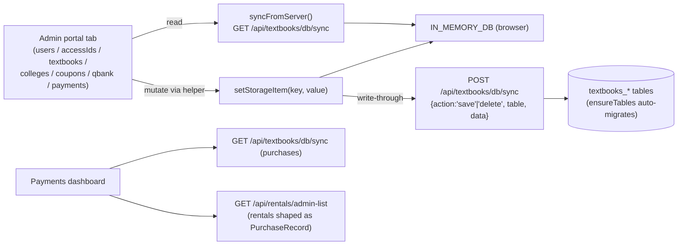

- `/api/rentals/admin-list` deliberately reshapes `book_rentals` rows into the `PurchaseRecord` shape so the admin Payments table concatenates purchases + rentals and reuses one filter/render path.
- Admin portal auto‑refreshes the active tab's data on an interval.

---

## 15. API Reference

### Textbooks / auth
| Method + path | Purpose |
|---|---|
| `POST /api/textbooks/auth/signup` | Create / claim consumer account (email + password). |
| `POST /api/textbooks/auth/login` | Password login; returns `purchasedBooks` + `rentedBooks`. |
| `GET /api/textbooks/auth/me?email=` | Refresh entitlements for a logged‑in reader. |
| `POST /api/textbooks/auth/request-otp` | Issue OTP to email or phone (`accessId`, `target`). |
| `POST /api/textbooks/auth/verify-otp` | Verify OTP → JWT (8 h). Admin/demo bypass `783490`. |
| `POST /api/textbooks/auth/change-password` | Change password (portal profile). |
| `POST /api/textbooks/auth/add-caller-id` | Register a Twilio caller ID during signup. |
| `POST /api/textbooks/auth/seed-admin` | One‑time production admin seed. |
| `POST /api/textbooks/auth/reset-admin-password` | Admin password recovery. |

### Textbooks / data & content
| Method + path | Purpose |
|---|---|
| `GET / POST /api/textbooks/db/sync` | Hydrate / write‑through the portal mirror. Runs `ensureTables()`. |
| `GET /api/textbooks/published` | List PDF filenames in `public/portal_textbooks`. |
| `GET/POST /api/textbooks/user/orders` | Reader's order history. |
| `GET/POST/DELETE /api/textbooks/user/addresses` | Shipping address book. |
| `POST /api/textbooks/quiz/notify-students` | Email a scheduled quiz to students. |
| `POST /api/textbooks/quiz/send-results` | Email ranked result sheet to faculty. |

### Payments (store — physical / soft)
| Method + path | Purpose |
|---|---|
| `POST /api/payments/cashfree/create-order` | Resolve Access ID, create Cashfree order, return `payment_session_id`. |
| `POST /api/payments/cashfree/verify` | Post‑redirect verification → insert `textbooks_purchases`, update user. |
| `POST /api/payments/cashfree/webhook` | Signed async finalization (safety net). |
| `GET /api/payments/cashfree/my-purchases?user=` | Paid `book_id`s for a user identifier. |

### Rentals
| Method + path | Purpose |
|---|---|
| `POST /api/rentals/create` | Create `pending` rental + Cashfree order (price computed server‑side). |
| `POST /api/rentals/renew` | Create child renewal rental + Cashfree order. |
| `POST /api/rentals/verify` | Activate rental after payment; compute `expires_at`. |
| `POST /api/rentals/access` | Issue 2‑hour reader session + signed PDF URL. |
| `GET /api/rentals/my-rentals?email=|phone=|accessId=` | Grouped active / expired / pending rentals. |
| `GET /api/rentals/plans` | Rental plans (DB override → `RENTAL_PLANS`). |
| `GET /api/rentals/check-expiry?secret=` | Cron: expire + send warning/expired emails. |
| `GET /api/rentals/admin-list` | All rentals shaped as `PurchaseRecord` for admin. |

### Quotation
| Method + path | Purpose |
|---|---|
| `POST /api/quotation/request` | Submit institutional request + PDF + emails. |
| `GET/POST /api/quotation/confirm` | Fetch quote; confirm with uploaded stamp → order. |
| `GET/POST/PUT/DELETE /api/quotation/books` | Manage quotable book list (admin for writes). |
| `/api/quotation/admin/*` | `login`, `verify`, `dashboard`, `requests`, `quotations`, `review`, `orders`, `settings`, `forgot-password`, `reset-password`. |

---

## 16. Page / Route Map

| Route | File | Notes |
|---|---|---|
| `/textbooks` | `app/textbooks/page.tsx` → `TextbooksClient` | Marketing: Upcoming vs Published tabs. |
| `/textbooks/{slug}` | `app/textbooks/[slug]/page.tsx` → `BookDetailClient` | SSG per book; SEO meta + JSON‑LD. |
| `/textbooks/store` | `app/textbooks/store/page.tsx` | Catalog + cart + format/plan/rental selectors. |
| `/textbooks/store/checkout` | `app/textbooks/store/checkout/page.tsx` | 3‑step: details → review → pay (Cashfree). Handles post‑redirect verify. |
| `/textbooks/library` | `app/textbooks/library/page.tsx` | Redirects to portal login → *My Library*. |
| `/textbooks/portal/login` · `/signup` | `app/textbooks/portal/**` → `TextbookPortal` | Dual auth; role‑gated tabs. |
| `/textbooks/app` | `app/textbooks/app/page.tsx` | `TextbookPortal` in `appMode` (PWA reading app, SW `public/textbook-app-sw.js`). |
| `/textbooks/reader/[rentalId]` | `app/textbooks/reader/[rentalId]/page.tsx` | Secure rental reader. |
| `/quotation` · `/quotation/success` · `/quotation/confirm/[id]` | `app/quotation/**` | Public quotation request + confirm. |
| `/quotation/admin/**` | `app/quotation/admin/**` | Quotation back office. |

Components: `components/Textbooks/` — `TextbooksClient`, `Upcoming`, `PublishedBooks`, `BookDetailClient`, `Manuscript`, `Upload`, `EditorialDetails`, `RenewModal`, `RentalPlanSelector`, `RentalTimer`, `RentalBadge`.

---

## 17. Environment Variables

| Variable | Used by |
|---|---|
| `DATABASE_URL` | `lib/dbPool.ts` (all server routes). Placeholder/missing → local JSON fallback. |
| `CASHFREE_APP_ID` · `CASHFREE_SECRET_KEY` · `CASHFREE_ENV` (`TEST`/`PRODUCTION`) | All payment + rental order creation/verification. Missing creds → mock session (dev only). |
| `JWT_SECRET` | OTP session tokens (`auth/verify-otp`). Default fallback string if unset. |
| `AWS_REGION` · `AWS_ACCESS_KEY_ID` · `AWS_SECRET_ACCESS_KEY` · `S3_BUCKET_NAME` | Signed PDF URLs (`rentals/access`), quotation stamp upload (`lib/s3.ts`). `MY_AWS_*` variants also read. |
| `SMTP_HOST/PORT/USER/PASS/FROM` · `TEXTBOOK_SMTP_*` · `TEXTBOOK_ADMIN_EMAIL` | Textbook + order + quiz emails (`lib/mailService.ts`). |
| `QUOTATION_SMTP_HOST/PORT/USER/PASS` · `QUOTATION_SMTP_FROM` | Quotation emails (dedicated transporter). |
| `TWILIO_ACCOUNT_SID` · `TWILIO_AUTH_TOKEN` · `TWILIO_PHONE_NUMBER` | SMS OTP (`lib/otpService.ts`). |
| `RENTAL_EXPIRY_CHECK_SECRET` | Guards `GET /api/rentals/check-expiry`. |

Scheduling: AWS Amplify has no built‑in scheduler, so the rental‑expiry cron is driven by the GitHub Actions workflow `.github/workflows/rental-expiry-check.yml` (daily `0 3 * * *` UTC, plus manual `workflow_dispatch`).

Build: `scripts/inject-env.js` runs in Amplify `preBuild`/`build` (see `amplify.yml`) so `NEXT_PUBLIC_*` and required vars are baked into the production build (fix history: commit `6377b45`). `scripts/generate-missing-pdfs.js` runs before `next build`.

---

## 18. Known Behaviors & Edge Cases

- **Abandoned `pending` rentals / unpaid store carts** leave no side effects (store) or a harmless `pending` `book_rentals` row (rental) — there is no sweeper job.
- **Client mirror vs DB drift:** the portal shows `IN_MEMORY_DB`; a hard refresh re‑hydrates from `db/sync`. Money/access decisions always re‑hit Postgres.
- **`ensureTables()` cost:** every `db/sync` call issues many `CREATE/ALTER … IF NOT EXISTS`. Cheap on Postgres but noisy in logs; failures are caught and the request proceeds.
- **Admin master bypass `783490`** works even with the database unreachable — intentional recovery hatch; keep it out of public docs.
- **Demo accounts:** Access IDs on `*@lurnexa.in` accept `783490`. `initDb()` strips stale demo users (`99999…` phones, `@lurnexa.in` emails) and enforces exactly one admin.
- **Rental ≠ ownership:** never write a `book_id` into `purchased_books` from a rental path.
- **S3 optional:** without AWS creds, rental PDFs serve from `public/portal_textbooks/{pdfFileName}` — the same path portal owned‑book reading uses (not `public/pdfs`, which is research papers).
- **Cover image case sensitivity** bit production before (commit `7028055`) — keep `coverImg` / `pdfFileName` casing exact.

---

## 19. Extending the Subsystem — Checklists

**Add a new textbook**
1. Add the record to `PUBLISHED_BOOKS_DATA` in `lib/data/books.ts` (unique `id`, `slug`, `code`, ISBNs, prices, `pdfFileName`, `coverImg`, ToC, keywords).
2. Drop the cover in `public/portal_coverpages/` and the PDF in `public/portal_textbooks/` (exact case).
3. If it has a caselet, add its `id` to `bookHasCaselet` and set `hasCaselet: true`.
4. Set `rentalEnabled: true` (+ optional `rentalPriceOverride`) to allow rentals.
5. Add the lightweight registry entry via the admin *Textbooks* tab (or let `initDb` defaults seed it), plus a `book_chapters` / `practice_configs` entry if using the quiz/practice engine.
6. Deploy (rebuilds SSG pages, sitemap, and generates any missing PDF).

**Add a rental plan** — edit `RENTAL_PLANS` in `lib/data/rentals.ts` *or* insert into `book_rental_plans` (DB wins). Keep `durationDays` / `price` / `sortOrder` consistent; `getRentalGST` / `getRentalTotal` handle the rest.

**Change pricing** — only in `getPhysicalPrice` / `getSoftCopyPrice` (`lib/data/books.ts`) and `RENTAL_PLANS`. The storefront, checkout, and order‑create routes all read these; do not hardcode elsewhere.
